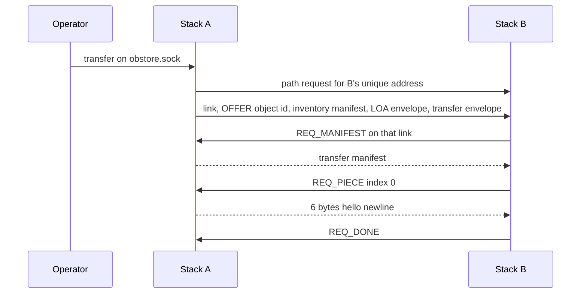

# Object services

prnsd hosts the object store, import, transfer, and release for a stack. The command line is `object-services` (`obstore/src/main.rs`). A debug build is `obstore/target/debug/object-services`. On Windows that file is `object-services.exe`.

Every command takes `--config DIR`. `DIR/config` is the stack file. prnsd listens for those commands on `DIR/obstore.sock`. On Unix that path is a socket, mode 0600. On Windows the file contains `127.0.0.1:<port>` and the service listens on that loopback port. 

```text
./prnsd/target/release/prnsd run --config DIR
```

On Windows, build that exe once and start each stack from it:

```text
prnsd\target\debug\prnsd.exe run --config DIR
```

When `[object-services]` is present and valid, prnsd prints the unique object-transfer address and the command socket:

```text
object-services: object-transfer address a4d544e05f5cde9676a5c17797b05837
object-services: listening on DIR/obstore.sock for DIR/object-store
```

If the heading is absent, prnsd skips the service. If the heading is present and the section is invalid, prnsd logs `object_services_config_invalid` and does not start it.

## Two addresses, one name

The name is `reticulum` / `object-transfer`. The name is an input to the destination hash. The hash is the endpoint. The same name produces two hashes.


| Address | How it is calculated                                                                                          | Who hears it                              |
| ------- | ------------------------------------------------------------------------------------------------------------- | ----------------------------------------- |
| Plain   | Hash of the name alone. Every stack gets the same value.                                                      | Every object service, on every interface. |
| Unique  | Hash of that same name mixed with this stack's identity. This is the address prnsd prints, 32 hex characters. | That one stack.                           |


The unique address comes from `DIR/storage/transport_identity` (64 bytes: X25519 secret, then Ed25519 seed). prnsd creates that file. The service does not.

```text
sha256( sha256("reticulum.object-transfer")[..10] ‖ identity_hash )[..16]
```

`identity_hash` is the first 16 bytes of `sha256(encryption_public ‖ signing_public)`.

### Plain address

A release, a who-has, a claim, and a request for the transfer manifest are plain packets. Transport does not carry a plain packet past the next hop. The object service on the receiving stack hears it, and repeats it on every interface except the one it arrived on. The hop count inside the message is what stops the flood. A node that receives `0` is included and does not forward. A node that receives a count above `0` forwards that count minus one.

The wire header of the plain packet stays a one-hop broadcast. It is not the flood counter. A plain message that does not fit in one broadcast packet is split, marked `OBPL`, and reassembled by the next object service before it is handled or repeated.

### Unique address

A transfer, a remote catalog, a preview, a piece pull, a transfer-manifest reply, and a direct claim are aimed at one unique address. prnsd path-requests that address and opens a link. Transport can carry that path. The first bytes on the link are an `OBXF` version 2 message. The stack that opened the link sends a body larger than one link packet as a resource. The stack that accepted the link sends its reply as link packets, because the opener does not prove data that comes back.


| Message                                                                   | Address                                                  |
| ------------------------------------------------------------------------- | -------------------------------------------------------- |
| `import`, `fetch`, `release`, `who-has`, `transfer` from the command line | Local `obstore.sock` only                                |
| Release announcement                                                      | Plain                                                    |
| Who-has                                                                   | Plain                                                    |
| Claim                                                                     | Plain, and also a link to the requester's unique address |
| Request for the transfer manifest                                         | Plain                                                    |
| Transfer-manifest reply                                                   | Link to the requester's unique address                   |
| Transfer offer, and the pull of the manifest and pieces                   | Link to the destination's unique address                 |
| Piece pull after a claim (`GIVE_PIECE`)                                   | Link to the holder's unique address                      |
| Remote catalog and preview                                                | Link to the remote stack's unique address                |


## Stack config

Paths in the config are relative to `DIR` unless they are absolute.

```text
[object-services]
  [[object-service]]
    object-store-directory = object-store
    cdn = No
    cdn-group = site-a
    auto-stage = Yes
    auto-update = No
    board = heltec-v4

  [[object-transfer]]
    object-transfer-directory = object-transfer
    minimum-bytes-per-second = 1000
```


| Key                         | Meaning                                                                                                        |
| --------------------------- | -------------------------------------------------------------------------------------------------------------- |
| `object-store-directory`    | Where object bytes and envelopes are stored. Required.                                                         |
| `object-transfer-directory` | Where release notices and who-has state are stored. Required.                                                  |
| `cdn`                       | `Yes` fetches a release whose `CDN-group` claim is `all` or one of the configured groups.                      |
| `cdn-group`                 | Repeatable group name, for example `site-a`.                                                                   |
| `auto-stage`                | `Yes` fetches firmware whose `mode` claim is `auto-stage`.                                                     |
| `auto-update`               | `Yes` fetches firmware whose `mode` claim is `auto-update`.                                                    |
| `board`                     | Board id that firmware claims must match, for example `heltec-v4`.                                             |
| `minimum-bytes-per-second`  | Who-has floor. An offer slower than this is held while the search widens. `0`, the default, accepts any offer. |


There is no destination key. The unique address is derived. prnsd does not read `<object-transfer-directory>/peers`.

## Store layout

```text
<object-store>/
  loa/                            This node's LOA credential directory. Mode 0700.
    local/                        Mode 0700. Present when this node is the LOA.
      private                     32-byte Ed25519 seed. Mode 0600.
      public                      32-byte verifying key. Mode 0644.
    trusted/                      Mode 0755. One file per trusted LOA public key.
      <64-hex>                    Raw verifying key. The file name is the key in hex.
  data/.incoming/                 Staging directories for an import in progress.
  data/<object-id>/
    data                          The object bytes. The object id is their SHA-256.
    manifest                      Inventory line for those bytes.
    LOA-envelope                  Claims, object id, and Ed25519 signature.
    transfer-manifest             Piece list. Written the first time the object is offered or released.
    LOA-transfer-envelope         Claims signed over the transfer manifest.
    pieces/<index>                Present only while a transfer is still assembling.
```

```text
<object-transfer>/
  releases/<object-id>            One release notice. A repeat of the same object is ignored.
  who-has/<object-id>/<index>/<requester-hex>/
    seen-<hops>                   This hop count was already handled.
    claims/<holder-hex>           Bytes/second of that holder's offer.
  manifest-asks/<object-id>/<requester-hex>/seen-<hops>
```

`loa/local/private` is this stack's signing seed, and only when this node is the LOA. Trusted LOA public keys live in `loa/trusted`. `create-lod` writes `local` and installs that same public key into `trusted`. prnsd does not create either at startup. A node that only verifies has files in `trusted` and an empty `local`.

On Unix the store sets the modes in the tree: `loa` and `loa/local` are 0700, `private` is 0600, `public` is 0644, and `trusted` is 0755. On Windows a new file inherits its directory's access list. After an import renames a staged directory into `data`, the store flushes `data`. The Windows flush opens that directory for write and sets `FILE_FLAG_BACKUP_SEMANTICS`, which is the handle the flush accepts.

## Local object domain

A local object domain (LOD) is the scope in which one Local Object Authority manages objects. Every node in a LOD has the same LOA public key installed in `loa/trusted`. That key is how those nodes verify an envelope signed by the LOA. The signature covers the claims and the object id. A node verifies with a trusted public key. The LOA holds the matching signing key.

A release is checked before it is remembered or forwarded. An envelope that does not verify against a trusted key is dropped, so it does not occupy the release slot and it does not flood further. The same check applies to an offered object envelope and to a transfer envelope before either is stored. A node with no trusted LOA public key fails these requests with `This node is not part of a local object domain`.

Creating a LOD generates those credentials. Run it on one machine, once for that LOD:

```text
object-services create-lod --config DIR
object-services create-lod --config DIR --offline
object-services trust-loa --config DIR --public-key HEX
```

`create-lod` asks the running prnsd to write `loa/local/private`, `loa/local/public`, and `loa/trusted/<64-hex>`, then prints the LOA public key, 64 hex characters. `--offline` writes those files without a running prnsd. A second run fails. `trust-loa` copies a verifying key into `loa/trusted` and creates an empty `loa/local` when this node is not the LOA. The firmware image can carry that public key at flash time. After the node is running, an RC Operator can set or replace the key on the node. Setting the key adds the node to that LOD. Replacing the key moves the node into the LOD of the new key.

A request that needs the LOA credentials fails with `This node is not part of a local object domain` when they are missing. Signing an import, signing a transfer envelope, and `import-releases` are such requests. A plain import, an import of an envelope that is already signed, a fetch, and startup itself do not create credentials and do not require them.

The authority to set a node's LOA public key is a remote-control grant. Operators receive it automatically, together with the OTA grant and the other operator grants.

Joining an administrative domain is a pairing. A LOD has no pairing exchange. The RC Operator who already controls the node sets the public key, or the key is written when the firmware is flashed.

## Commands

```text
object-services create-lod --config DIR [--offline]
object-services trust-loa --config DIR --public-key HEX
object-services import --config DIR --file PATH [--as-owner --claims NAME=VALUE,...]
object-services import --config DIR --file PATH --envelope PATH --authority HEX
object-services fetch --config DIR --object-id HEX --file PATH
object-services transfer --config DIR --object-id HEX --destination HEX
object-services who-has --config DIR --object-id HEX --index N
object-services release --config DIR --object-id HEX [--hops N]
object-services import-releases --config DIR [--set preview] [--set stable]
```


| Command           | Arguments                                                                                                                                                                                                                                                                                                                                                                                                               | Result                                                                                                                                                                                                                         |
| ----------------- | ----------------------------------------------------------------------------------------------------------------------------------------------------------------------------------------------------------------------------------------------------------------------------------------------------------------------------------------------------------------------------------------------------------------------- | ------------------------------------------------------------------------------------------------------------------------------------------------------------------------------------------------------------------------------ |
| `create-lod`      | `--offline` writes the files directly. Without it, prnsd must already be listening.                                                                                                                                                                                                                                                                                                                                     | Creates a LOD. Writes `loa/local/private`, `loa/local/public`, and `loa/trusted/<64-hex>` once and prints the LOA public key. Fails when the private key is already present.                                                   |
| `trust-loa`       | `--public-key` is the Ed25519 verifying key, 64 hex.                                                                                                                                                                                                                                                                                                                                                                    | Installs that key in `loa/trusted`. Creates `loa/local` when it is missing. The same key may be installed again.                                                                                                               |
| `import`          | `--file` is the bytes to store. `--claims` is a comma-separated `name=value` list and requires `--as-owner`. `--envelope` is an already signed envelope file; `--authority` is the signer's Ed25519 verifying key (64 hex) or identity public key (128 hex, signing half is the last 32 bytes). `--claims` and `--envelope` cannot be combined. With neither, the bytes are stored with a manifest and no LOA envelope. | Prints the object id on stdout.                                                                                                                                                                                                |
| `fetch`           | `--object-id` is 64 hex. `--file` is the path to write.                                                                                                                                                                                                                                                                                                                                                                 | Writes the stored `data` bytes. Checks the SHA-256 before replacing `--file`.                                                                                                                                                  |
| `transfer`        | `--destination` is the receiver's unique object-transfer address, 32 hex.                                                                                                                                                                                                                                                                                                                                               | Offers the object over a link. The receiver pulls the manifest and pieces. The object must already have a signed LOA envelope.                                                                                                 |
| `who-has`         | `--index` is the piece number in the local transfer manifest.                                                                                                                                                                                                                                                                                                                                                           | Prints the holder address, 32 hex. Searches hop rings `0` through `8` on the plain address.                                                                                                                                    |
| `release`         | `--hops` defaults to `8` and cannot exceed `8`.                                                                                                                                                                                                                                                                                                                                                                         | Announces the LOA envelope on the plain address. Each forward decrements the hop count.                                                                                                                                        |
| `import-releases` | `--set` repeats. Empty means preview, then stable.                                                                                                                                                                                                                                                                                                                                                                      | Downloads signed firmware from `https://reticulum.rs/releases/`, stores it, and signs it with this stack's LOA. Prints each object id on stdout. A missing preview channel is a notice on stderr; the stable import continues. |


`import-releases` opens the object-store directory in this process and writes the firmware there. It stores two objects per board. The USB object is a zip of `target.json` and the board's files, with `flash-mode=usb`. The OTA object is the exact file that would be sent to the board, with `flash-mode=ota`. Those imports do not set a `mode` claim, so a later `release` of them does not match `auto-stage` or `auto-update` until that claim is present. Only the LOA stack can sign them, the one with `loa/local/private`.

On Unix, mode 0600 on `obstore.sock` is the import access check. On Windows the file names a loopback port, and any process on the machine can connect. The short import header is not signed.

## Data types

Hex in the tables is the text form. Inside an `OBXF` message, an object id is the 64 ASCII hex characters, a destination is 16 raw bytes, and a piece hash is 32 raw bytes. Lengths and indexes are little-endian.

### Object id

SHA-256 of `data`, 64 hex characters.

```text
5891b5b522d5df086d0ff0b110fbd9d21bb4fc7163af34d08286a2e846f6be03
```

That value is `sha256` of the six bytes `hello\n`.

### Destination

16 bytes, printed as 32 hex characters. On the unique address this is the printed object-transfer address. On the plain address every stack shares one hash, and that hash is not what the commands print.

### Claims

At most 32 claims and 64 KiB. A name starts with an ASCII letter or digit and may contain `-` and `_`. The names `object-id`, `signature`, and `length` are reserved. Values are non-empty and contain no control characters. Duplicate names are rejected.

The command form is `name=value`. The stored form is `name value\n`.

```text
object-type firmware
channel stable
board heltec-v4
version 0.3.7-hotfix.5
artifact application
path firmware/hopspot/heltec-v4/0.3.7-hotfix.5/application.bin
commit 310f4790622b04407555ab79a49d12c50858c48d70b08b569339a8700ef04f30
provenance reticulum-release
offset 65536
flash-mode ota
```

### Object manifest

```text
object-id 5891b5b522d5df086d0ff0b110fbd9d21bb4fc7163af34d08286a2e846f6be03
length 6
```

The manifest is inventory. The store writes it from the object id and the length. It is not a voucher.

### LOA envelope

The signature is Ed25519 over every line before `signature`, including `object-id`. The signature is 64 bytes, written as 128 hex characters. The file does not contain the signer's public key.

```text
board heltec-v4
provenance local-build
object-id 5891b5b522d5df086d0ff0b110fbd9d21bb4fc7163af34d08286a2e846f6be03
signature <128 hex characters>
```

### Transfer manifest

Pieces are 4096 bytes. The last piece is shorter. An object may be at most 32 MiB. Piece size is the stride. Piece length is how many bytes this piece contains. Every piece except possibly the last has length equal to the size. A 4097-byte object is piece 0 of 4096 and piece 1 of 1. For `hello\n` the single piece is the whole file, so the piece hash equals the object id.

```text
object-id 5891b5b522d5df086d0ff0b110fbd9d21bb4fc7163af34d08286a2e846f6be03
length 6
piece-size 4096
piece 0 5891b5b522d5df086d0ff0b110fbd9d21bb4fc7163af34d08286a2e846f6be03
```

### LOA transfer envelope

The file stores the claims and a signature. The signed bytes are the claims followed by the transfer manifest. The manifest itself stays in `transfer-manifest`. A receiver keeps the envelope it was given. It does not sign a new one.

```text
board heltec-v4
provenance local-build
signature <128 hex characters>
```

### Who-has

Sent on the plain address.


| Field        | Example                                                              |
| ------------ | -------------------------------------------------------------------- |
| object id    | `5891b5b5…f6be03`                                                    |
| index        | `0`                                                                  |
| piece hash   | the 32 bytes named by `piece 0`                                      |
| piece size   | `4096`                                                               |
| piece length | `6`                                                                  |
| requester    | the seeker's unique address                                          |
| hops         | `0` on the first ring, then `1`, up to `8`                           |
| bytes/second | `18446744073709551615` (`u64::MAX`) until a receiver lowers it       |
| identity     | the seeker's X25519 public key and Ed25519 public key, 32 bytes each |
| signature    | Ed25519, 64 bytes                                                    |


The signature covers `who-has`, the object id, the index, the piece hash, the piece size, the piece length, the requester address, and the two public keys. `hops` and `bytes/second` stay outside it, because each hop changes them. A node derives the object-transfer address from the public keys and checks the signature before it remembers the request, relays it, or opens a link. A request whose address does not match that identity, or whose signature does not match, is dropped.

The manifest request is signed the same way. Its signature covers `need-manifest`, the object id, the requester address, and the two public keys. `hops` stays outside it. The same check runs before the request is remembered, relayed, or answered with a link.

The first ring is a send of hops `0`, so only the next stacks are included and they do not forward. A node that receives a count above `0` stays quiet about the piece and relays, even if it has the piece. Only the node that receives `0` answers, and only if it has the matching piece.

A node that receives a who-has replaces `bytes/second` with the rate of the interface the packet arrived on, when that rate is lower and the interface has a measured rate. It then relays or answers using that one updated value. A link that is already carrying a piece pull does not apply the rate again.

The dedup key is the object id, the piece index, the requester address, and the hops.

### Claim

The answer to a who-has. `bytes/second` is the minimum the who-has had accumulated when the holder heard it. The holder waits a short random backoff, shorter when more hops are left, and stays quiet if it hears a claim for the same object id and index.


| Field        | Example                                                              |
| ------------ | -------------------------------------------------------------------- |
| object id    | same as the who-has                                                  |
| index        | `0`                                                                  |
| piece hash   | same as the who-has                                                  |
| requester    | the seeker's unique address                                          |
| holder       | the holder's unique address                                          |
| bytes/second | `1000000`                                                            |
| identity     | the holder's X25519 public key and Ed25519 public key, 32 bytes each |
| signature    | Ed25519, 64 bytes                                                    |


The signature covers `claim`, the object id, the index, the piece hash, the requester address, the holder address, the rate, and the two public keys. A node derives the object-transfer address from the public keys and checks the signature before it records the claim. A claim that names another holder, or whose rate was changed after signing, is dropped. A holder can still sign a claim for a piece it does not have, or for a rate it cannot sustain. The piece hash check rejects any other bytes.

The claim is sent on the plain address, and the holder also opens a link to the requester's unique address and writes the claim there. A node that receives a claim records it and does not relay it. The seeker takes the fastest claim at or above `minimum-bytes-per-second`. Slower claims stay in `claims/`. The search widens one hop at a time. When the rings are exhausted, the seeker uses the fastest claim it kept.

### Release notice

Sent on the plain address. The notice carries the origin stack's unique address and the LOA envelope. A node decides from that envelope. It does not ask for the transfer manifest before deciding.


| Field     | Example                                                      |
| --------- | ------------------------------------------------------------ |
| object id | `5891b5b5…f6be03`                                            |
| origin    | the announcing stack's unique address                        |
| hops      | `8` at the origin. Each forward stores and sends `hops - 1`. |
| envelope  | the LOA envelope text                                        |


Every node that receives a release with hops left forwards it, including a node that will not fetch. A node fetches only when it does not already have the object and the envelope matches its fetch policy:

- CDN: `cdn = Yes` and `CDN-group` is `all` or a configured group.
- Firmware: `mode` is `auto-update` or `auto-stage` and that flag is `Yes`, `flash-mode` is `ota`, `object-type` is `firmware`, `board` matches, and `version` is one this store does not already have.

A node with neither CDN nor auto-stage nor auto-update forwards the release and does not fetch. It can ask later with who-has.

## Direct transfer

Stack A holds `hello\n` and a signed LOA envelope. Stack B's unique address is the value B printed at startup. Both stacks are running prnsd, and B is reachable by a path.

```text
object-services import --config stack-a --file hello.txt --as-owner \
  --claims board=heltec-v4,provenance=local-build
```

Stdout is the object id:

```text
5891b5b522d5df086d0ff0b110fbd9d21bb4fc7163af34d08286a2e846f6be03
```

A then offers it. `--destination` is B's unique address.

```text
object-services transfer --config stack-a \
  --object-id 5891b5b522d5df086d0ff0b110fbd9d21bb4fc7163af34d08286a2e846f6be03 \
  --destination bbbbbbbbbbbbbbbb2222222222222222
```




The offer is a pull. A does not push the manifest or the pieces. B stores the inventory manifest and the LOA envelope from the offer before it asks for anything else. It checks the object envelope signature against a public key in `loa/trusted`. The signed bytes are the claims and the object id. It asks for the transfer manifest, checks `object-id`, `length`, and `piece-size 4096`, and checks the transfer envelope signature over the claims and that manifest before storing `transfer-manifest` and `LOA-transfer-envelope`. An envelope that does not verify is not stored. For piece `0` it checks the SHA-256 against `piece 0`, stores the bytes, and checks that the joined bytes hash to the object id. It writes `data` and removes `pieces/`. A later piece request reads `pieces/<index>` while that directory exists, and otherwise slices `data` at `index * piece-size`.

A blob on the wire is a `u32` little-endian length followed by the bytes. Request bytes are `0` done, `1` manifest, `2` piece, and `255` reject.

An object with no LOA envelope can be stored and fetched locally. A transfer requires the signed envelope, because the offer carries it.

## Release and fetch

Three stacks. A has the object and a signed LOA envelope whose claims match C's policy. B is a neighbor of A and is not configured to fetch. C is a neighbor of B, with `auto-stage = Yes` and `board = heltec-v4`. C does not already have version `0.3.7-hotfix.5`. A, B, and C are linked by their interfaces. They do not need a peers file.

`obstore/examples/three-nodes.sh` recreates those three installations. A is the LOA: `loa/local` holds the private and public keys, and `loa/trusted` holds the same public key. B and C have that public key in `loa/trusted` and an empty `loa/local`. A listens on `127.0.0.1:48001`, B connects to A and listens on `127.0.0.1:48002`, and C connects to B. `share_instance` is `No` and `enable_transport` is `Yes`, so the three processes stay separate and B can forward between A and C.

The envelope A releases:

```text
mode auto-stage
flash-mode ota
object-type firmware
board heltec-v4
version 0.3.7-hotfix.5
object-id 5891b5b522d5df086d0ff0b110fbd9d21bb4fc7163af34d08286a2e846f6be03
signature <128 hex characters>
```

```text
object-services release --config stack-a \
  --object-id 5891b5b522d5df086d0ff0b110fbd9d21bb4fc7163af34d08286a2e846f6be03 \
  --hops 2
```

```mermaid
sequenceDiagram
    participant A as Stack A
    participant B as Stack B
    participant C as Stack C

    A->>B: plain RELEASE hops 2, origin A's unique address, LOA envelope
    B->>C: plain RELEASE hops 1
    Note over B: claims do not match, still forwards
    C->>C: plain RELEASE hops 0 to C's neighbors
    Note over C: claims match, start fetch
    C->>B: plain NEED_MANIFEST hops 0
    Note over B: no manifest, no answer
    C->>B: plain NEED_MANIFEST hops 1
    B->>A: plain NEED_MANIFEST hops 0
    A-->>C: link to C's unique address, MANIFEST
    C->>B: plain WHO_HAS hops 0
    Note over B: hops above 0 would relay; hops 0 and no piece, no claim
    C->>B: plain WHO_HAS hops 1
    B->>A: plain WHO_HAS hops 0
    A-->>C: plain CLAIM, and a link to C's unique address
    C->>A: link to A's unique address, GIVE_PIECE index 0
    A-->>C: the piece bytes
```


A sends hops `2` on the plain address. B receives `2`, forwards `1`, and does not fetch. C receives `1`, forwards `0`, and fetches because the envelope matches. The neighbor that receives `0` does not forward.

C asks outward for the transfer manifest on the plain address. A hop count of `0` is answered only by a neighbor that has the manifest. B does not, so C sends the next ring. B relays that to A. A has the manifest, waits a short random backoff (at most 30 ms), and returns it on a link to C's unique address. Each ring waits 200 ms.

C then searches for piece `0` the same way. The who-has leaves C at `u64::MAX` bytes/second. Each hop lowers that value to the arrival interface's rate when the interface has one. A holder that receives hops `0`, has the piece, and likes the rate returns a claim naming A's unique address. C's floor is `0`, so the claim qualifies and C does not open another ring.

C opens a link to that holder and sends `GIVE_PIECE` with the object id, index `0`, the piece hash, piece size `4096`, and piece length `6`. A answers with the six bytes. C checks the hash, stores the piece, joins the pieces into `data`, and deletes the piece files. C now has the same object id A released.

While pieces are still arriving, a node can serve a piece it has already stored. After `data` is written, that same piece is read back out of `data`.

## On-device store

A directory is one way to keep those records. An embedded device can keep a few fixed-size stores, one object in each. The store's capacity is its size. The object is the bytes up to its length. Bytes past that length stay in the store and stay out of the hash.

On a device that updates in place, an OTA slot is the `data` of one of those stores. The running image is one object. A second slot, holding an image that is staged and not yet running, is a second object. The object id is the SHA-256 of the image bytes.

The LOA signing seed stays with the authority. The device keeps the transfer envelope that authority signed for the image. It stores the transfer manifest beside that envelope, or rebuilds the manifest from the slot when a neighbor asks. Rebuilding walks the image in pieces of 4096 bytes, hashes each piece, and writes the same lines a directory store writes: `object-id`, `length`, `piece-size 4096`, and one `piece` line for each slice. The signature covers the claims followed by that manifest text, so the rebuilt text verifies when it is the manifest the LOA signed.

```text
fixed store
  data                      The OTA slot. The object ends at the firmware length.
  LOA-transfer-envelope     Kept as the LOA signed it.
  transfer-manifest         Stored, or rebuilt from data.
```

A request for the transfer manifest returns that text. The asker checks it against the transfer envelope. A piece request reads the slot at `index * 4096` for 4096 bytes, or the shorter tail of the last piece. A who-has for a piece the slot contains is answered with a claim, and the device serves that piece. The image in the slot is the object other nodes fetch, so the device is a distribution point for its own firmware.

## Local stand-in

`object-services serve --config DIR` is the stand-in that does not use Reticulum. It binds both `DIR/obstore.sock` and `DIR/object-transfer.sock`. On Unix each path is a socket, mode 0600. On Windows each file contains `127.0.0.1:<port>` and the service listens on that loopback port. Neighbors are one path per line in `<object-transfer-directory>/peers`, each line another stack's `object-transfer.sock`. Remembered paths are `<object-transfer-directory>/paths/<destination-hex>`. The same `OBXF` messages are written on those connections. prnsd does not bind `object-transfer.sock` and does not read `peers`.

## Store browser

`obstore/browser` is the desktop catalog. It reads a store without importing, signing, or creating files. Pass a directory to open it:

```text
cargo run --locked --manifest-path obstore/browser/Cargo.toml -- example-nodes/a/object-store
```

`example-nodes` is what `obstore/examples/three-nodes.sh` writes. The repo has no `target/test-stacks` directory. A stack config directory, the object-store root, or that store's `data` directory all open the local catalog. To browse another stack, put its object-transfer address in the remote field. The path is then the config directory of the local object service, which must already be listening on `obstore.sock`.

On Windows the window uses the system WebView2 runtime, which Windows 11 includes, and the crate builds once `obstore` does. On Linux the desktop shell links WebKitGTK 4.1. Debian and Ubuntu need `libgtk-3-dev` and `libwebkit2gtk-4.1-dev` before that crate will build. A WSL install does not include those packages until they are installed. macOS uses the system web view.
